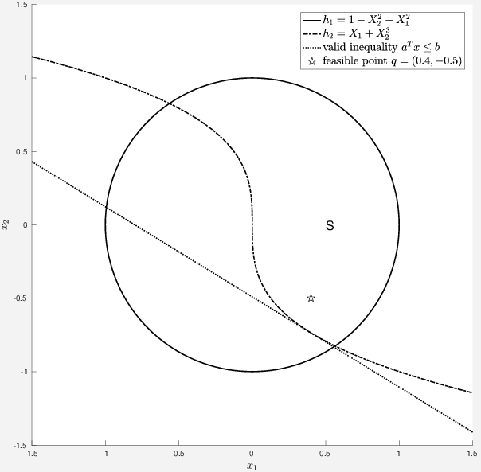

# vis3p 

## About
vis3p is part of a research project in nonlinear mathematical optimization. vis3p computes and draws valid linear inequalities for sets that are given by polynomial inequalities, using a method known as sos programming. As of now, drawing is limited to two dimensions. It is an implementation of the ideas in Chapter 2 in my [PhD thesis](https://hdl.handle.net/11858/00-1735-0000-0023-3F9C-9) and the examples provided here will be used in an upcoming publication (joint work with [Prof. Dr. Anita Schöbel](https://optimierung.math.uni-goettingen.de/index.php?section=members&subsection=schoebel&lang=de)).

## Example output

The output may look like the following.

## Requirements

You need the following software installed. I specify the software version that worked for me; it may work with other versions. All MATLAB tools need to be in the path.

* [MATLAB 2016b](https://www.mathworks.com) as computing environment
* [Symbolic Math Toolbox](https:/mathworks.com/products/symbolic.html) to work with symbolic polynomials
* [SOSTOOLS 3.01](https://www.cds.caltech.edu/sostools) a MATLAB toolbox to convert sos programs into semidefinite programs
* [SeDuMi 1.3](http://sedumi.ie.lehigh.edu) semidefinite solver written in MATLAB
* [export_fig 99d1c37a9600abde20150ed0534b984241e5acc3](https://github.com/altmany/export_fig) is a MATLAB tool to export plots to eps-files

Note that vis3p has only been tested on Debian jessie (GNU/Linux). Some features like system calls (e.g., git integrity check for reproducable plots) may only work on Linux.

## Installation

* Clone the git repo
* Change the working directory to the repo path
* Start MATLAB
* Run vis3p to plot the scenarios (cf. the `Scenarios` folder) by invoking `SolveAndDrawAllScenarios` from the command prompt.

## What does the name vis3p stand for?
Valid Inequalities for Semi-algebraic Sets using Sos Programming. 
